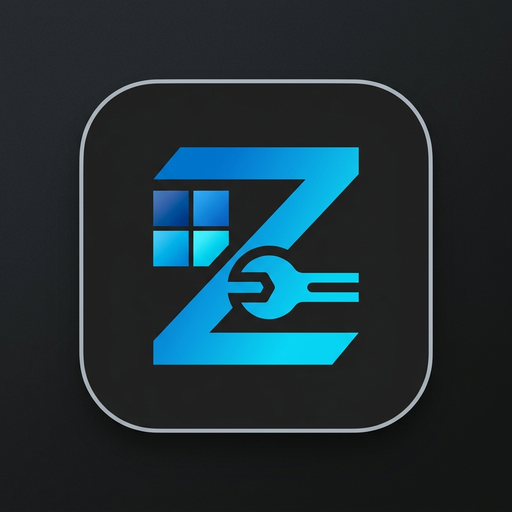
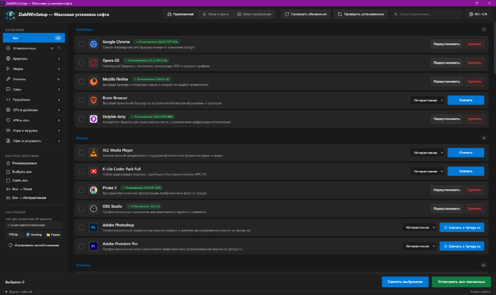
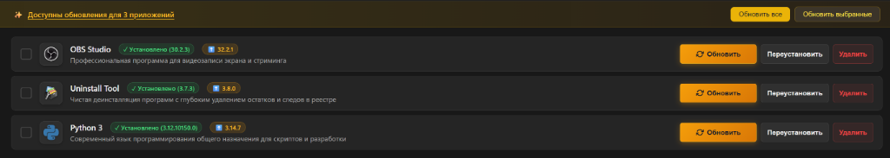
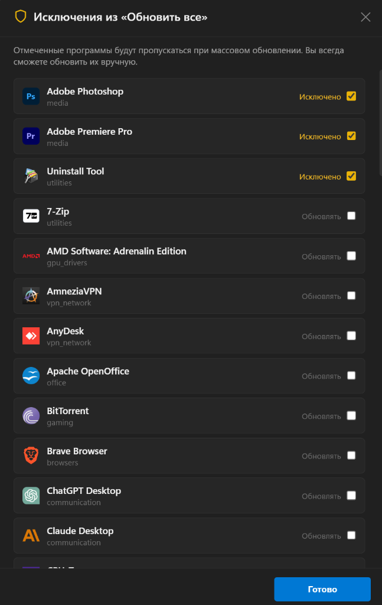
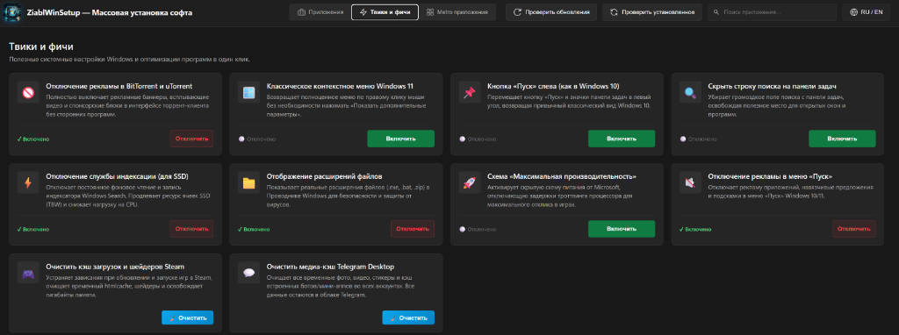
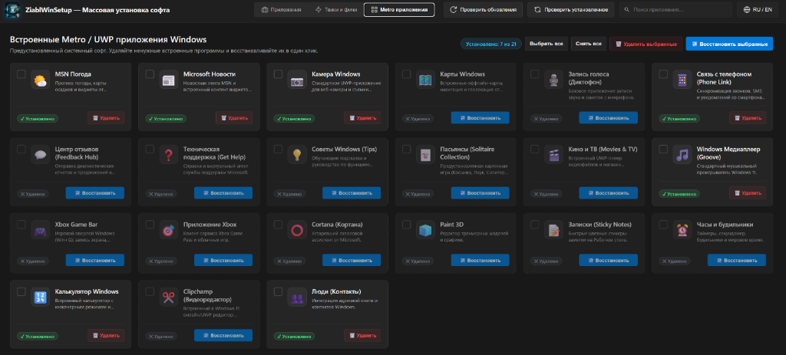

# 🚀 ZiablWinSetup

<div align="center">
  
  <h3>Современная утилита для массовой установки софта, драйверов и тонкой настройки Windows 10/11</h3>

  <p>
    <a href="https://github.com/DanielCarti/ZiablWinSetup/releases/latest"></a>
    <a href="https://github.com/DanielCarti/ZiablWinSetup/releases/latest"></a>
    
    
  </p>

  <p align="center">
    
  </p>
</div>

---

## 🌟 О проекте

**ZiablWinSetup** — это легковесный, автономный и быстрый инструмент для автоматической подготовки, установки софта и оптимизации системы после чистой установки Windows или покупки нового ПК.

Больше не нужно вручную открывать десятки сайтов, закрывать баннеры и кликать «Далее-Далее-Готово»: выберите нужные программы галочками, примените рекомендуемые твики системы и нажмите **«Скачать выбранное»**!

<p align="center">
  
</p>

Интерфейс разделен на три ключевые рабочие зоны:
1. **[Приложения]** — обширный каталог из 58 актуальных программ и утилит с пакетной загрузкой и тихой установкой.
2. **[Твики и фичи]** — моментальная оптимизация Windows, ускорение SSD, удаление встроенной рекламы и возврат классического меню.
3. **[Metro приложения]** — встроенный деблоатер предустановленных UWP-приложений Windows с возможностью удаления и восстановления в один клик.

---

## ✨ Ключевые возможности

### 📦 1. Богатый каталог софта (58 приложений)
Все программы распределены по 9 удобным категориям с мгновенным поиском и фильтрацией:

* 🌐 **Браузеры**: Google Chrome, Opera GX, Mozilla Firefox, Brave, Dolphin{anty}
* 🎬 **Медиа**: VLC Media Player, K-Lite Codec Pack Full, Picasa 3, OBS Studio, Adobe Photoshop, Adobe Premiere Pro
* 🔧 **Системные утилиты**: 7-Zip, WinRAR, Everything, Total Commander, EarTrumpet, CPU-Z, HWiNFO, ShareX, PowerToys, CrystalDiskInfo, CrystalDiskMark, OCCT, Uninstall Tool, Unlocker, Unchecky
* 💬 **Связь и мессенджеры**: Telegram Desktop, Discord, Claude Desktop, ChatGPT, Todoist
* 💻 **Разработка**: Visual Studio Code, PyCharm Community, Sublime Text, Notepad++, Git, Python 3, Eclipse Temurin JDK 21, Open Code Interpreter, Claude Code
* 🖥️ **GPU и драйверы**: NVIDIA App, AMD Software: Adrenalin, GPU-Z, FurMark, Driver Booster
* 🔒 **VPN и сеть**: AmneziaVPN, Zapret (обход блокировок Discord & YouTube), YogaDNS, TeleProxy, Opera Proxy, AnyDesk
* 🎮 **Игры и загрузки**: Steam, qBittorrent, BitTorrent, Dropbox
* 📑 **Офис и документы**: Obsidian, LibreOffice, OpenOffice

**Особенности менеджера загрузок:**
- Пакетное скачивание в несколько параллельных потоков с отображением прогресс-бара и скорости.
- Поддержка тихой (фоновой) установки без участия пользователя.
- Автоматическая распаковка ZIP-архивов и создание готовых ярлыков на Рабочем столе (Zapret и др.).

---

### 🔄 2. Интеллектуальный центр обновлений

<p align="center">
  
</p>

- **Автоматический мониторинг версий**: сканирование установленного софта через Winget и GitHub Releases API.
- **Информативная панель**: мгновенное уведомление о количестве доступных обновлений.
- **Редизайн кнопки «Обновить»**: выразительная Windows 11 кнопка с подсветкой и акцентным градиентом прямо на карточке программы.
- **Гибкие исключения**: удобное модальное окно для исключения программ из массового обновления (например, для специфических или портативных версий ПО).
- **Синхронизация на лету**: повторное сканирование системы без перезапуска приложения.

<p align="center">
  
</p>

---

### ⚡ 3. Системные твики и оптимизация («Твики и фичи»)

<p align="center">
  
</p>

Каждый твик сопровождается подробным описанием и безопасным переключателем:

| Твик | Описание и эффект |
| :--- | :--- |
| 🚀 **Максимальная производительность** | Разблокировка и активация скрытой схемы электропитания Windows *Ultimate Performance* для максимального отклика CPU. |
| 📁 **Показ расширений файлов** | Автоматическое включение отображения расширений всех типов файлов в Проводнике. |
| 📋 **Классическое контекстное меню** | Возврат полного контекстного меню в стиле Windows 10 в проводнике Windows 11 (без пункта «Показать дополнительные параметры»). |
| 🚫 **Блокировка рекламы в торрентах** | Полное отключение встроенных рекламных баннеров и всплывающих промо в клиентах BitTorrent и uTorrent (с возможностью обратного включения). |
| 💾 **Отключение индексации SSD** | Остановка и отключение службы `WSearch` (Windows Search) для снижения фонового износа ячеек памяти SSD (TBW) и разгрузки диска. |
| 🔍 **Скрытие поиска на Панели задач** | Отключение громоздкой поисковой строки на панели задач для освобождения свободного места. |
| 📌 **Выравнивание Панели задач влево** | Перенос меню «Пуск» и закреплённых иконок к левому краю экрана в стиле Windows 10. |
| 🧹 **Очистка кэша Steam** | Удаление накопившегося кэша HTML-браузера, шейдеров и временных файлов загрузок Steam без затрагивания игр. |
| 💬 **Очистка медиа-кэша Telegram** | Безопасное освобождение гигабайтов кэша видео, аудио и изображений Telegram Desktop. |
| 🔇 **Отключение рекламы в меню Пуск** | Блокировка рекомендаций, подсказок и рекламных плиток в меню «Пуск» Windows 10/11. |

---

### 🪟 4. Встроенные Metro / UWP приложения («Metro приложения»)

<p align="center">
  
</p>

Удобный графический деблоатер стандартных Windows AppX-пакетов:
- **Контроль над 21 встроенным приложением**: Погода MSN, Новости, Кортана, Связь с телефоном, Камера, Карты, Xbox Game Bar, Запись голоса, Советы, Microsoft Solitaire, Paint 3D, Clipchamp и др.
- **Удаление в один клик**: быстрое удаление предустановленного «мусора» через официальный PowerShell AppX API.
- **Восстановление в один клик**: повторная регистрация из системного хранилища Windows или переход на страницу в Microsoft Store.
- **Пакетные операции**: выделение нужных приложений чекбоксами и одновременное удаление или восстановление.

---

### 🎨 5. Дизайн и эргономика
- **Windows 11 Fluent Design**: полупрозрачность Mica, гарнитура Segoe UI Variable, стилизованные чекбоксы и кнопки.
- **Поддержка тем**: переключение между тёмной и светлой темами оформления.
- **Мгновенный перевод интерфейса (RU / EN)**: бесшовное переключение языка на лету без перезапуска.
- **Защита от случайного прерывания**: диалоговое предупреждение при попытке закрыть окно во время активного скачивания или установки.

---

## 🚀 Как запустить

### Вариант 1. Готовый EXE-файл (Рекомендуется)
Скачайте актуальный релиз без необходимости устанавливать Python и зависимости:

👉 **[Скачать последнюю версию ZiablWinSetup.exe](https://github.com/DanielCarti/ZiablWinSetup/releases/latest)**

Просто сохраните файл и запустите его от имени администратора.

### Вариант 2. Запуск из исходного кода
```bash
# Клонируйте репозиторий
git clone https://github.com/DanielCarti/ZiablWinSetup.git
cd ZiablWinSetup

# Установите зависимости
pip install -r requirements.txt

# Запустите проект
python main.py
```
Либо дважды кликните по файлу `run.bat`.

---

## 🛠️ Сборка собственного EXE

Для компиляции автономного исполняемого файла используется **PyInstaller**:
```bash
pyinstaller --clean ZiablWinSetup.spec
```
Или выполните скрипт сборщика:
```cmd
build.bat
```
Собранный исполняемый файл будет помещён в директорию `dist/ZiablWinSetup.exe`.

---

## 💻 Стек технологий

- **Ядро**: Python 3.10+ (ctypes, subprocess, winreg, urllib, Win32 API)
- **GUI-движок**: [pywebview](https://pywebview.flowrl.com/) (Microsoft Edge WebView2 Chromium)
- **UI/UX**: HTML5, Vanilla CSS3 (Fluent Design System, CSS Variables, Flexbox/Grid), SVG-иконки
- **Менеджеры пакетов**: Winget CLI, GitHub REST API, прямые CDN-зеркала
- **Сборка и CI/CD**: PyInstaller, GitHub Actions (.github/workflows/release.yml)

---

## 📄 Лицензия

Проект распространяется под лицензией **MIT**.
